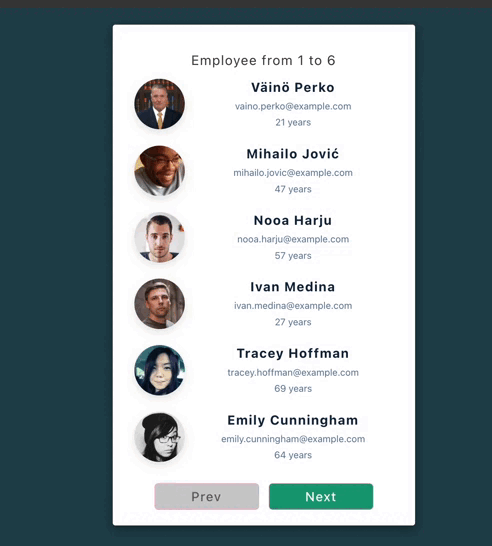

# Employee List App 👥

A simple React app that displays a paginated list of employees using dummy data. Users can navigate through employees in groups of 6 using Next and Prev buttons.

## 🎬 Demo

View employee details and navigate between pages.



## ✨ Features
- Displays employee info: photo, name, email, and age  
- Pagination with Next and Prev buttons  
- Uses React hooks for state management  
- Clean component structure with reusable Person component  

## 🛠️ Tech Stack
- React  
- JavaScript  
- SCSS for styling  

## 🚀 How to Run
1. Clone the repository:  
~~~bash
git clone https://github.com/Shuaa-99/EmployeeList
cd employee-list-app
~~~

2. Install dependencies:  
~~~bash
npm install
~~~

3. Start the development server:  
~~~bash
npm run dev
# or
npm start
~~~

4. Open your browser at:  
http://localhost:3000

## 🗂️ Project Structure
```
src/
├── components/
│ └── list/
│ └── Home.jsx
├── styles/
│ └── scss/
│ ├── _variables.scss
│ ├── _reset.scss
│ └── _mixins.scss
└── App.js
```
Note:
Employee images are not stored locally but are loaded directly from external URLs provided in the data.js file, using services like randomuser.me for placeholder photos.
